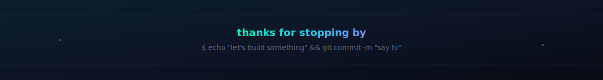

<p align="center">
  <a href="https://tragicmj.com"></a>
  <a href="https://www.linkedin.com/in/md-javed-akhtar/"></a>
  <a href="https://stackoverflow.com/users/9907503/md-javed-akhtar"></a>
  
</p>


<table>
<tr>
<td width="60%" valign="top">

### `> about`

I'm a **Senior Software Engineer** working across two connected products — **Book An Artist** and **Wescover** — where I own the React Native mobile app and lead creator-facing features across web and mobile.

I work the full slice: **React/Redux + GraphQL** on the frontend, **Node.js + MongoDB** on the backend, and everything in between — native tooling, CI/CD, and the occasional legacy-codebase archaeology.

```txt
role      Senior Software Engineer
based_in  Kolkata, India
owns      React Native app (BAA)
leads     Creator-facing features
stack     JS/TS · React · Node · MongoDB
```

</td>
<!-- <td width="40%" valign="top">

### `> currently`

- 🔧 React Native upgrade `0.74 → 0.85`
- 📱 Android 16KB page-alignment fixes
- 🌍 Multi-region pricing & currency architecture
- 💳 Payout infra research (Stripe Connect)
- 🖥️ Setting up a new Apple Silicon dev rig

</td> -->
</tr>
</table>


### `> stack`

<table>
<tr><td><b>Languages</b></td><td>


</td></tr>
<tr><td><b>Frontend / Mobile</b></td><td>


</td></tr>
<tr><td><b>Backend</b></td><td>

<!--  -->
<!--  -->
</td></tr>
<tr><td><b>Database</b></td><td>

<!--  -->

</td></tr>
  
<tr><td><b>Monitoring / Analytics</b></td><td>


</td></tr>
<tr><td><b>Tools</b></td><td>
<!--  -->
<!--  -->


</td></tr>
</table>


### `> stats`

<p align="left">
  
  
</p>
<p align="left">
  
</p>


### `> connect`

<p align="left">
<a href="https://tragicmj.com"></a>
<a href="https://www.linkedin.com/in/md-javed-akhtar/"></a>
<a href="https://stackoverflow.com/users/9907503/md-javed-akhtar"></a>
<a href="https://www.instagram.com/javed.akhtar432/"></a>
</p>


